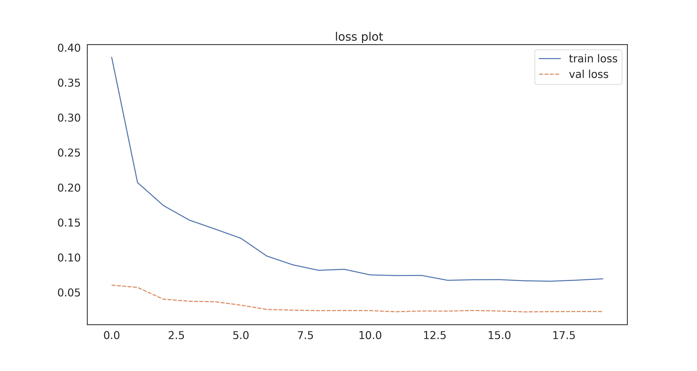
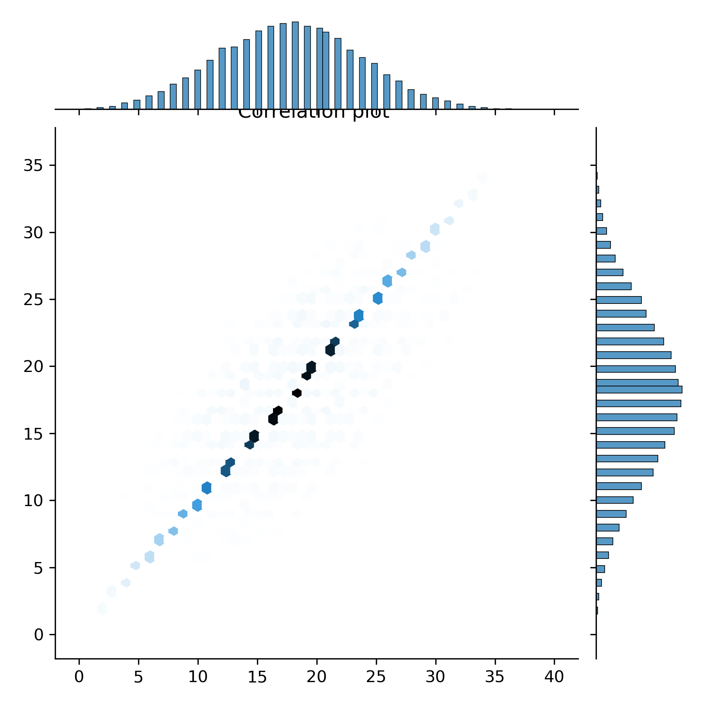

# Multi-Handwritten-digit-recognition-Model
> The model was constructed by using `pytorch` libraries and builtin dataprocessing methods in `openCV`

## Instructions to run the Model

- clone this repository
- Install few packages like torch, tqdm, seaborn etc
- If facing issues with dependecies then refer to the conda environment yml file to set up the environment required to run th files
- Run the `Simple-MNIST-CNN.ipynb` notebook to create a CNN network trained on MNIST dataset and save the model 
- To test the model on the new test datasetrun the `Testing-MNIST-Model.ipynb`

- The pretrained models have been saved in `MODELS` directory.
- The best model so far is alredy imported in the Testing-MNIST-notebook.ipynb by default

###### loss plot

###### Prediction vs true values on the new dataset

###### The best performance so far
76.38 %
